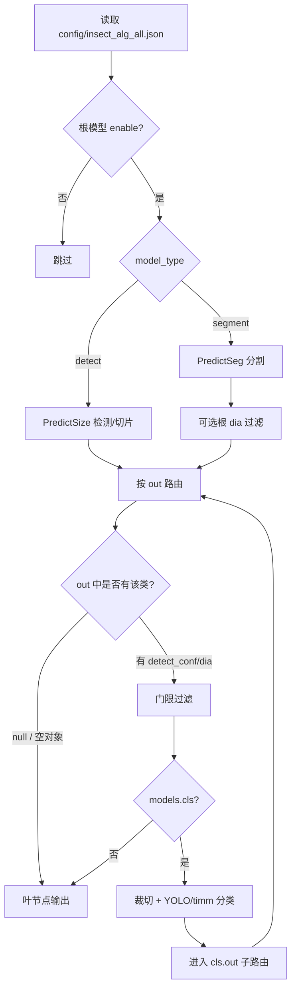

# 虫情算法 JSON 配置说明

> 目录：`insect/script/config/`（推理/训练共用静态配置）  
> 主配置：**`config/insect_alg_all.json`** — 由 `predict_all.InsectPredictAll` / `create_pipeline()` 加载。  
> 路径解析：`script/config_paths.py`；相对路径相对于 `insect/script/`。
> 实现与默认值以 `predict_all.py` 内 `_DETECT_DEFAULTS`、`_SEGMENT_DEFAULTS`、`_CLS_NODE_DEFAULTS` 为准；本文档随代码维护，变更配置项时请同步更新本文。

---

## 1. 配置文件一览

| 文件 | 用途 | 加载入口 |
|:---|:---|:---|
| **`config/insect_alg_all.json`** | **统一多根推理配置**（检测/分割根模型、`out` 路由、嵌套分类） | `predict_all.load_insect_alg_all()` |
| `config/insect_info.json` | 物种元数据（中文名、体长、样本数等），**不参与推理门限** | `script.config.insect_info`、标注/报表 |
| `config/insect_info.py` | `insect_info.json` 加载与区域索引 | `load_json_catalog`、`json_record` 等 |

**路径约定**

- `config/insect_alg_all.json` 中 **`model` 建议使用绝对路径**；若写相对路径，需自行保证与部署机器目录一致。
- 通过 `config_path` 传入的**相对路径**一律相对于 **`script/`**（`predict_all.resolve_insect_alg_all_path`），与进程当前工作目录无关。

**代码入口示例**

```python
from script.predict_all import create_pipeline, predict

pipe = create_pipeline("config/insect_alg_all.json", device="cuda")
results = pipe.predict(image_bgr)
pipe.release()
```

---

## 2. 顶层结构

```json
{
  "prepare": {
    "clip_profiles_enable": true,
    "roi_switch": true,
    "roi_plugins": ["disk_circle"],
    "roi_disk_max_border_mean": 120
  },
  "postprocess": {
    "dia_switch": false
  },
  "models": {
    "<根模型ID>": { ... },
    "detect_big": { ... }
  }
}
```

### 公共段 `prepare` / `postprocess`

| 段 | 用途 | 典型键 |
|:---|:---|:---|
| **`prepare`** | 推理**前**全图预处理 / 切片开关，对所有根模型生效（单根可覆写） | `clip_profiles_enable`、`roi_switch`、`roi_plugins`、`roi_disk_*` |
| **`postprocess`** | 推理**后**公共过滤开关，对所有根模型生效（单根可覆写） | `dia_switch`、`bin_dark_ratio_min`、`debug` |

合并顺序（后者覆盖前者）：**类型默认值** → **`prepare` + `postprocess`** → **根模型 `models.<id>` 内显式字段**。

**`postprocess` 常用键**

| 字段 | 默认 | 说明 |
|:---|:---|:---|
| `dia_switch` | `true` | 是否启用对角线 `dia` 尺寸过滤（detect/segment 根及 `out` 路由） |
| `bin_dark_ratio_min` | `0.2` | **仅 detect 根**：检测框裁切经全图灰度 min-max 归一化 + Otsu 二值化后，较暗簇像素占框内面积的下限；低于则过滤，调试图标为 `bin_dark(0.19<0.20)`；`<=0` 关闭 |
| `debug` | `false` | `true` 时将 `in_big_conf` 二值化/分母 mask 拼图保存到 ``{OUTPUT_DIR}/eval_metrics/debug/`` |

- 根模型内**不必重复**写已在公共段声明的键；需要例外时在根下单独写同名键即可覆盖。
- 代码入口：`predict_all._merge_root_cfg` / `resolve_root_cfg_from_alg()`；`InsectPredictAll` 注册根模型时已合并。

- **`models` 下每个键** = 一个**根模型**（独立跑一张图，结果 `source` 字段为该 ID）。
- **`enable: false`**：跳过该根，不加载权重。
- **`model_type`**：`detect`（框检测 + 可选尺寸/路由）或 `segment`（实例分割 + `out` 路由）。

---

## 3. 推理流程（运维速览）



**`out` 路由规则摘要**

| `out.<类名>` 取值 | 含义 |
|:---|:---|
| **`null`** | 叶节点：不再嵌套分类，直接输出（类名来自检测/分割或上一级分类） |
| **`{}` 空对象** | 同上（叶节点） |
| **对象** | 可含 `detect_conf`、`cls_conf`、`dia`、`cn_name`、`infer_name`、`models` |

- 分割根：实例先按 **`seg` 类别名** 对齐 `out` 的键（如 `yee`、`ming`），再进入子图。
- 检测根：实例按 **`cls_name`** 对齐 `out` 的键。
- **`out` 键支持正则**（Python `re.fullmatch`）：如 `"yee|ming"` 同时匹配 `yee` 与 `ming`；`"*"` 匹配任意类名。按 JSON 中键的**声明顺序**取首个命中项（先声明者优先）。
- **尺寸区间键**（如 `"[50, 300)"`）：按实例外接框**对角线像素** `dia` 匹配，语义为 **50≤dia<300**（方括号/圆括号为开闭区间，与数学区间写法一致）。与类名键按**同一声明顺序**竞争；未命中区间键时再尝试类名键；`*` 通配符**始终最后**匹配。未提供 bbox 时区间键不参与匹配。
- **`enable`**：写在 `out.<键>` 对象内；未配置视为 `true`，`false` 时跳过该分支（可落到后续键或 `*`）。
- 不在 `out` 中的类 → 丢弃（`collect_filtered` 时为 `no_route`）。
- 分类结果为 **`other`** → 丢弃。

---

## 4. 根模型公共字段

以下字段在 **detect / segment 根** 均可出现（未列出则见各类型专表）。

| 字段 | 类型 | 默认（约） | 说明 |
|:---|:---|:---|:---|
| `enable` | bool | `true` | 是否启用该根 |
| `model` | string | — | **必填**，`.pt` 权重绝对/相对路径 |
| `model_type` | string | `detect` | `detect` 或 `segment` |
| `detect_conf` | float | detect 0.3 / segment 0.25 | 检测或分割置信度门限；与旧键 `conf_thresh` 等价 |
| `dia` | `[min,max]` | 无 | 外接框**对角线像素**范围；根级对 detect/segment 实例先过滤 |
| `out` | object | 无 | 类别路由子图（见第 3 节） |
| `to_square` | bool | detect 假 / segment 真 | 见第 7 节「补方与 `to_square`」 |
| `augment` | bool | `false` | YOLO 推理增强 |
| `half` | bool | `false` | FP16（主要 detect 路径） |
| `conf_merge` | float | 0.1 | 切片/整图推理低阈值出框（再按 `detect_conf` 标记 filter）；合并阶段候选池下限 |
| `conf_merge_draw` | float | 0.01 | 仅 `DRAW_FILTER` 收集过滤框时使用的更低 YOLO conf（可绘制低于 0.1 的候选）；未配置时用默认 0.01 |
| `ior_threshold` | float | detect 0.4 / segment 0.5 | IoR 合并阈值 |
| `clip_size` | int | detect 640 / segment 0 | 切片边长；**0 = 不切片整图推理** |
| `overlap_size` | int | detect 120 / segment 0 | 切片重叠 |
| `nms_iou` | float | 无 | 传给 YOLO NMS（可选） |
| `max_det` | int | 无 | 最大检测数（可选） |
| `nms_agnostic` | bool | 无 | 类无关 NMS（可选） |
| `gray_contrast_enhance` | bool | `false` | **检测/分割**送入 YOLO 前是否对整图/切片做灰度 **CLAHE** 对比度增强（见 §4.2） |
| `gray_clahe_clip` | float | `2.0` | CLAHE **对比度上限**（OpenCV `clipLimit`）：越大局部拉亮/压暗越狠；常见 1.2～2.0，见 §4.2 |
| `gray_clahe_tile` | int | `8` | CLAHE **分块格数**（OpenCV `tileGridSize`）：把 resize 后边长均分为 `tile×tile` 块，**不是像素边长**；`tile` 越大块越小、越局部，见 §4.2 |
| `gray_contrast_debug_save` | bool | `false` | 为 `true` 时，批处理/推理入口会把 CLAHE 预览图写入**该图的结果输出目录**（与标注图同目录）；见 §4.2 |

### 4.2 检测/分割输入预处理（与分类预处理区分）

检测根、分割根在调用 YOLO **之前**对整图（或滑窗切片）做通道与对比度处理；**嵌套 `models.cls` 的裁切分类不走本段逻辑**。

| 阶段 | 配置项 | 作用对象 | 说明 |
|:---|:---|:---|:---|
| ① 预缩放 | （自动，与 `seg_imgsz` / 检测 `imgsz` 一致） | 整图/切片 | **先** resize 到 YOLO 推理边长（如 1280×1280），与模型实际输入尺度对齐 |
| ② 对比度增强 | `gray_contrast_enhance` + `gray_clahe_*` | 同上 | 灰度 → **CLAHE** → 通道适配；**不做 Otsu 二值化** |
| ③ 通道适配 | （自动） | 同上 | `ch=1` → `(H,W,1)`；`ch=3` → BGR |
| 分类裁切 | `gray_binarize` / `to_gray` | polygon/bbox 裁切块 → 分类器 | 仅分类；顺序 `gray_binarize → to_square → to_gray`（§6.1） |

**处理顺序（检测/分割，`gray_contrast_enhance=true`）**：`resize(imgsz) → 灰度 → CLAHE → 通道适配 → YOLO.predict(imgsz)`（输入已与 `imgsz` 同尺寸，YOLO 不再二次缩放）。

**`gray_clahe_tile` 含义**：OpenCV 将**当前已 resize 后的边长**均分为 `tile×tile` 块（如 1280 且 `tile=8` → 每块约 160×160 px）；`tile=4` → 约 320×320 px；`tile=1` → 整图一块（近似全局均衡）。

**`gray_clahe_clip` / `gray_clahe_tile` 如何影响增强**

- **`gray_clahe_clip`（对比度上限）**：限制每个小块里直方图均衡的放大倍数。  
  - **偏小（1.2～1.5）**：增强温和，背景网格、翅脉不易被「刷」出来，大目标不易碎。  
  - **偏大（2.5～3.0）**：暗的更暗、亮的更亮，浅色虫可能更易检出，但粘虫板纹理、碎屑、透明翅脉也更容易变成假目标。  
- **`gray_clahe_tile`（分块格数，不是像素）**：图先被切成 `tile` 行 × `tile` 列，**每块单独**做均衡。  
  - **tile 小（如 4）** → 块大（1280 上约 320px）→ 更「全图感」，块与块之间边界少。  
  - **tile 大（如 16）** → 块小（1280 上约 80px）→ 更「局部」，网格/小纹理更易被逐块抬高。  
  - 想要约 **320×320 px** 一块：`tile ≈ seg_imgsz ÷ 320`（1280 时用 `4`）。

**与训练对齐**

- 单通道分割模型（如 `seg-3.8.5.pt`，训练 `ch=1`）默认推理为 **plain 灰度**；开启 `gray_contrast_enhance` 属于**推理侧增强**，训练未做 CLAHE 时可能提升低对比度召回，也可能放大粘虫板网格等纹理误报，需在北京全标注等集上 **A/B 对比**。
- **`to_gray` 写在根上时只传给分类**（`cls_to_gray`），**不改变**检测/分割 YOLO 的整图输入；整图灰度由模型 `ch=1` 自动转换，或由 `gray_contrast_enhance` 显式增强。
- **勿用 `gray_binarize` 做检测**：该开关含 CLAHE+Otsu 硬二值化，仅用于分类裁切，会破坏检测所需边缘信息。

**配置示例**（`detect_big`，ch=1 分割 + 嵌套 cls）：

```json
"to_gray": true,
"gray_contrast_enhance": true,
"gray_clahe_clip": 2.0,
"gray_clahe_tile": 8
```

实现：`resolve_gray_contrast_options()` → `PredictSeg` / `PredictSize` → `ModelSegmenter` / `ModelDetector` → `preprocess_yolo_input()`；预 resize 后 YOLO 出框坐标经 `yolo_input_coord_scale()` 映射回送入预处理前的图幅。

**预览增强效果**（不跑 YOLO 或推理时自动落盘）：

- 配置 `"gray_contrast_debug_save": true` 后，通过 `predict_all` 批处理推理时，每张图会在**该图结果输出目录**（与输出 jpg/xml 同目录）写出一张 PNG：`{stem}_gray_clahe_c{clip}_t{tile}.png`（CLAHE 后灰度，与送入模型一致）。
- 仅看单张效果可运行 `script/tools/preview_gray_contrast_enhance.py`（改脚本内 `IMAGE_PATH` / `OUTPUT_DIR` 后直接运行）。

### 4.1 `out` 路由项字段

写在 `out.<类名>` 对象内（非 `null` 时）：

| 字段 | 说明 |
|:---|:---|
| `enable` | 是否启用该路由分支；默认 `true`，`false` 时跳过 |
| `cn_name` | 输出结果中的中文名（`cn_name` 字段） |
| `infer_name` | 覆盖输出 `name`（对外展示/落库用） |
| `detect_conf` | 该类**检测/分割框**置信度下限；未写则继承根 `detect_conf` |
| `cls_conf` | 该类**分类 top1** 置信度下限（写入扁平 `insect_alg` 表供 `resolve_cls_top1_threshold`） |
| `mask_rate` | 可选 `[lo, hi]`：种类确认后，用分割 **polygon 面积 / 外接框面积** 做闭区间过滤；未配置则不滤；无 polygon 无法计算时不滤。`predict_all.py` 可用 **`ENABLE_MASK_RATE_FILTER=False`**（或 `create_pipeline(..., enable_mask_rate_filter=False)`）全局关闭，忽略各类 `out.mask_rate` |
| `dia` | 该类实例外接框对角线像素范围 `[min, max]` |

**`mask_rate` 标定（`detect_big` / `cls.out`）**

- 数据来源：`doc/参考资料/样本分析/形态分析/mask-bbox分析.log`（`cls-seg` 透明 PNG 统计，脚本 `train_cls/11-stat_mask_bbox_fill_ratio.py`）。
- 规则：同类合并 `-ba` / `-beijing` / `-bei` / `-fu` 等子目录后，取各源 **最小值、P10、P90、最大值** 的并集；`lo = max(0.08, min(P10, min) − 0.10)`，`hi = min(0.98, max(P90, max) + 0.10)`（刻意留余量，不宜收得过紧）。
- 不写：`other`、无样本类（如 `nianmoyee`）、以及仅作兜底合并的 `chun` / `jingui` / `minge` 等粗类（细类已各自配置）。
- 特例：`xishuai` 合并统计含 `xiaoguantouxishuai`；`xuanyouyee` 对齐日志类名 `xuanqiyee`；天蛾三类（`ganshutiane` / `gouyuetiane` / `quewentiane`）共用天蛾子目录统计。
| `models.cls` | 嵌套分类子图（见第 6 节）；可与简写 **`cls`**（与 `models` 同级）等价 |
| `models` 下其它键 | 当前仅实现 **`cls`** |
| `models.cls.out` | **`{}` 或省略**：分类完成后**不再**按类名子路由，直接输出分类 top1；**`null` / 叶项 `{}`** 见第 3 节表 |

**推理阶段置信度下限（重要）**

- YOLO 实际使用的 `conf_thresh` = **根 `detect_conf` 与所有 `out.*.detect_conf` 的最小值**。  
- 这样可在根上设较高门限（如 0.3），同时为 `ming` 等类在 `out` 里设更低值（如 0.1），避免漏检。  
- 实例仍会在路由阶段按**各类自己的** `detect_conf` / `dia` 再滤一遍。

---

## 5. 检测根 `model_type: "detect"`

典型：`detect_daofeishi`（稻飞虱切片检测 + `out` 内嵌套分类）。

| 字段 | 默认 | 说明 |
|:---|:---|:---|
| `size_config_path` | 无 | `size.json` 路径；按类别宽高过滤，与 `dia` 可同时生效 |
| `offset_rate` | 1.2 | 尺寸过滤放宽系数 |
| `iou_threshold` | 0.3 | 检测框 IoU 合并 |
| `edge_reject_distance` | 5 | 距图像边缘像素，用于边缘误检过滤 |
| `edge_reject_conf_threshold` | 无 | 边缘框检测置信度阈值 |
| `edge_reject_cls_conf_threshold` | 无 | 边缘框分类置信度阈值 |
| `in_big_conf` | 无 | 稻飞虱框二值化黑色像素数 / 框∩大虫 polygon 像素数；相交为 0 不计算；**严格大于**门限时剔除 |
| `in_big_skip` | 无 | 与 `in_big_conf` 同 detect 根配置；大虫分割类名清单，判定时**不参与** IoU 参考 mask（如 `["wen", "dawen"]`） |
| `inner_boxes_fp_threshold` | 8 | 内嵌小框误检抑制 |
| `bin_dark_ratio_min` | 0.2 | 同 §2 `postprocess`；检测框 Otsu 较暗簇像素占比下限，低于则过滤（`bin_dark`） |
| `edge_dup_diag_ratio` | 无 | 边缘重复框对角线比（可选） |
| `gray_contrast_enhance` | `false` | 同 §4；检测 YOLO 整图/切片输入 CLAHE 增强 |
| `gray_clahe_clip` | `2.0` | 同 §4 |
| `gray_clahe_tile` | `8` | 同 §4 |
| `gray_binarize` | `false` | 分类前灰度二值化（根级传给 PredictSize；**仅分类裁切**，见 §4.2） |
| `to_gray` | `false` | 分类推理前最后一步转灰度三通道（根级 `cls_to_gray`；**不改变** YOLO 整图输入，见 §4.2） |
| `detect_pad_square` | 随 `to_square` | 切片检测前是否白底补方 |
| `detect_pad_square_full_image` | 随 `to_square` | 整图检测是否补方 |
| `cls_pad_square` | 随 `to_square` | 分类裁切是否补方 |

检测根 **`out` 内 `models.cls`** 时：检测框先出类，再进入 `_ClsRunner` 做细分类（与分割根嵌套 cls 相同逻辑）。

---

## 6. 分割根 `model_type: "segment"`

典型：`detect_big`（大虫分割 → `out.yee` → 夜蛾细分类）。

| 字段 | 默认 | 说明 |
|:---|:---|:---|
| `seg_imgsz` | 0 | 分割 YOLO `imgsz`；**0 表示用模型默认**。同义键：`infer_imgsz`、`imgsz` |
| `retina_masks` | `false` | Ultralytics `retina_masks` 高分辨率掩码；默认关闭，打开后掩码更精细（多边形更贴边），推理耗时/显存增加 |
| `poly_merge` | `false` | 多边形相似实例合并主开关；开启后按虫体轮廓相似度（边缘贴合 或 包含）合并同一目标的重复实例，治整图/切片下的过分割重复检出 |
| `poly_merge_edge_px` | `5.0` | 边缘贴合距离阈值（像素）：轮廓点到对方轮廓距离 ≤ 此值视为贴合 |
| `poly_merge_edge_ratio` | `0.5` | 边缘贴合比例阈值：贴合点占比 ≥ 此值即合并（双向取最大） |
| `poly_merge_contain_ratio` | `0.7` | 包含率阈值：一方轮廓点落入另一方内部占比 ≥ 此值即合并（双向取最大） |
| `poly_merge_cross_class` | `true` | 是否允许跨类合并；`false` 仅同类实例合并。合并后保留组内最高 `conf` 实例的类别与多边形，外接框取并集 |
| `poly_merge_max_points` | `80` | 轮廓相似度计算的等间隔下采样上限（每多边形），控制 O(n²) 性能 |
| `pad_full_image_to_square` | 随 `to_square` | 整图推理前白底补成正方形 |
| `crop_pad_ratio` | 0.05 | polygon 裁切外扩比例 |
| `min_instance_size` | 3 | 最小实例尺寸（像素） |
| `max_instance_size` | 无 | 最大实例尺寸（可选） |
| `padding` | `true` | 分割切片 padding |
| `from_bbox` | `false` | **根级**传给 `PredictSeg`：为 `true` 时用矩形裁切做分类；**仅当根上配置了 `cls` 权重时生效** |
| `gray_contrast_enhance` | `false` | 同 §4 公共字段；ch=1 分割模型可试开，缓解低对比度漏检 |
| `gray_clahe_clip` | `2.0` | 同 §4 |
| `gray_clahe_tile` | `8` | 同 §4 |
| `cls_crop_background` | 无 | 根级 polygon 掩码外填色（见 6.1）；**常规嵌套 cls 应写在 `out.*.models.cls` 下** |
| `cls_pad_color` | 白边 | 根级补方颜色（同上） |

当前 **`detect_big` 模式**：根上**不挂**分类权重，细分类在 **`out.yee.models.cls`**（或其它 `out` 项）中配置；根上的 `cls_crop_*` 不会作用于嵌套分类。

### 6.1 嵌套 `models.cls`（细分类）

**推荐写法**（与仓库内 `detect_big → out.yee` 一致）：

```json
"yee": {
  "cn_name": "夜蛾",
  "detect_conf": 0.3,
  "dia": [300, 2500],
  "models": {
    "cls": {
      "model": "/path/to/yee-cls.pt",
      "enable": true,
      "from_bbox": false,
      "to_square": true,
      "cls_crop_background": "black",
      "cls_pad_color": "black",
      "cls_conf": 0.1,
      "out": {
        "baitiaoyee": { "cn_name": "白条夜蛾", "dia": [500, 1300] },
        "fayee": null
      }
    }
  }
}
```

**ConvNeXt 示例**（`detect_big → out.yee.models.cls`，与 YOLO 共用裁切/路由/门限逻辑）：

```json
"cls": {
  "model": "best_convnext.pt",
  "cls_backend": "convnext",
  "timm_model": "convnextv2_base",
  "image_size": 224,
  "enable": true,
  "from_bbox": false,
  "to_square": true,
  "cls_conf": 0.1,
  "out": { "baitiaoyee": { "cn_name": "白条夜蛾" } }
}
```

| 字段 | 默认 | 说明 |
|:---|:---|:---|
| `enable` | `true` | 关闭则不走该分类器 |
| `model` | — | 分类权重路径：YOLO 为 `.pt`；ConvNeXt 为 ``train_cls_convnext`` 导出的 ``best_convnext.pt`` |
| `cls_backend` | `auto` | `yolo` / `convnext` / `auto`（`auto` 按 checkpoint 是否含 `model_state` 识别） |
| `timm_model` | 空 | **convnext 必填**（若 checkpoint 内无 `timm_model` 字段），须与训练时 `TIMM_MODEL_NAME` 一致，如 `convnextv2_base` |
| `image_size` | `0` | ConvNeXt 推理边长；`0` 表示用 checkpoint 内 `image_size` 或默认 224 |
| `from_bbox` | `true` | **`false`**：按 **分割 polygon** 裁切；**`true`**：按检测框矩形裁切 |
| `to_square` | `true` | 分类前是否补成正方形 |
| `cls_conf` | 0.3 | 本节点 `out` 表内各类的默认分类置信度门限 |
| `skip_dia_conf` | 无 | 分类 `cls_conf` **严格大于**该值时，跳过本路由及子路由上 `out.*.dia` 对角线过滤；配置后会**先分类再判 dia** |
| `gray_binarize` | `false` | 分类前灰度二值化（灰度 + CLAHE + Otsu） |
| `to_gray` | `false` | 分类**推理前最后一步**转灰度并扩成三通道（R=G=B）；不配置保持原彩色；顺序为 `gray_binarize → to_square → to_gray` |
| `crop_pad_ratio` | 0.05 | polygon 裁切外扩 |
| `cls_crop_background` | 空 | polygon **掩码外**填充（见下表） |
| `cls_pad_color` | 空→白 | **补方**时短边填充颜色（见下表） |
| `out` | 无 | 分类后的**子路由**（可再嵌套 `models.cls`） |

#### `cls_crop_background`（仅 `from_bbox: false` 且实例有 `polygon`）

| 配置值 | 行为 |
|:---|:---|
| 未配置 / `""` / `none` / `false` | **不填底**，矩形外接框内保留原图 |
| `"white"` | 掩码外填白 `(255,255,255)` BGR |
| `"black"` | 掩码外填黑 `(0,0,0)` |
| `[B,G,R]` 或 `"b,g,r"` | 自定义 BGR |

#### `cls_pad_color`（`to_square: true` 时）

| 配置值 | 行为 |
|:---|:---|
| 未配置 / `""` | **白边** `(255,255,255)`（历史默认） |
| `"white"` / `"black"` | 白边 / 黑边 |
| `[B,G,R]` | 自定义 BGR |

**与训练对齐提示**（夜蛾等 seg→cls 管线）

- 训练数据若使用 **透明边补方**（YOLO 读图常呈黑边），线上可对比：  
  - `cls_crop_background: "black"` + `cls_pad_color: "black"`  
  - 或不填底 + 白边（旧默认）  
-  val 集文件夹准确率 **不能** 直接代表 seg 裁切块线上效果，需用同 pipeline 抽 crop 评估。

---

## 7. 补方与 `to_square`

`to_square` 在不同类型上映射不同参数（`resolve_model_square_options`）：

| 模型类型 | `to_square` 主要影响 |
|:---|:---|
| **segment** | `pad_full_image_to_square`（整图/不切片前补方）、`cls_pad_square` |
| **detect** | `detect_pad_square`、`detect_pad_square_full_image`、`cls_pad_square` |

可显式写 `pad_full_image_to_square`、`detect_pad_square` 等**覆盖** `to_square`。

---

## 8. 统一输出格式（`predict_all`）

每条结果大致为：

```json
{
  "name": "baitiaoyee",
  "score": 0.87,
  "location": [x1, y1, x2, y2],
  "source": "detect_big",
  "cn_name": "白条夜蛾",
  "polygon": [[x,y], ...]
}
```

- **`source`**：根模型 ID（如 `detect_big`）。
- **`collect_filtered=True`** 时另返回被过滤项，含 `filtered`、`filter_reason`（`threshold` / `cls` / `no_route` / `dia` / `mask_rate` 等）。

---

## 9. 运维检查清单

部署或改配置后建议逐项确认：

1. [ ] 所有启用根的 **`model` 路径**在目标机器存在且版本正确（`best.pt` / `temp.pt` 等）。
2. [ ] **`enable`**：仅打开需要上线的根，避免重复加载大模型占显存。
3. [ ] **`seg_imgsz`** 与训练时一致（如大虫分割 960）。
4. [ ] **`out` 键名**与模型类别名一致（分割类名 / 检测类名大小写、拼写）。
5. [ ] 需要输出的物种在 `out` 中有条目或为可到达的 **`models.cls.out` 叶节点**。
6. [ ] **`detect_conf` / `cls_conf` / `dia`** 符合现场误检/漏检权衡；注意「根 conf 取 min」行为。
7. [ ] 嵌套 **`models.cls`** 的 `from_bbox`、`cls_crop_background`、`cls_pad_color` 是否按训练 pipeline 设置。
8. [ ] **ch=1 检测/分割模型**：是否按需开启 `gray_contrast_enhance`；调参时同步记录 `gray_clahe_clip` / `gray_clahe_tile`，并与北京评测集 A/B 对比。
9. [ ] 修改 JSON 后重启服务或 **`release()` 后重建 `InsectPredictAll`**（进程内会缓存模型）。

**常见问题**

| 现象 | 可能原因 |
|:---|:---|
| 某类永远不出 | `out` 无该类；`dia` 过窄；`detect_conf` / `cls_conf` 过高；分类为 `other` |
| 线上全是一类 | 分类裁切/补方与训练不一致；`out` 未包含真实类名；用了未收敛权重 |
| 改了 JSON 不生效 | 未重启；路径指错；`enable: false`；嵌套 cls 写在根上而非 `out.*.models.cls` |
| 显存占用高 | 多个 `enable: true` 的大根同时加载 |
| 开 CLAHE 后误报增多 | `gray_clahe_clip` 过大或粘虫板网格被放大；可降至 1.5 或关 `gray_contrast_enhance` |
| 以为 `to_gray` 会增强检测 | 根级 `to_gray` 仅作用于**分类裁切**；检测/分割整图用 `gray_contrast_enhance` 或模型 `ch=1` 自动灰度 |

---

## 10. 门限表（`build_alg_table_from_out`）

- **`config/insect_alg_all.json` 的 `out`** 会通过 `build_alg_table_from_out()` 生成扁平门限表，经构造参数 `insect_alg` 传入 `PredictSize` / `PredictSeg`，供 `resolve_cls_top1_threshold` 等解析 `detect_conf` / `cls_conf`。
- 门限**应仅在** `config/insect_alg_all.json` 的 `out.<类>.detect_conf` / `cls_conf` 维护。
- 单独跑分割验证等脚本仍可能读取 **`insect_alg_seg.json`**（默认路径；文件不存在则仅用代码内 `conf_thresh`）。

---

## 11. 参考

| 内容 | 位置 |
|:---|:---|
| 统一推理实现 | `predict_all.py` |
| 分割 + 可选单层分类 | `predict_seg.py` |
| 裁切/填色解析 | `predict_seg_lib.py` → `resolve_cls_crop_background`、`resolve_cls_pad_color` |
| YOLO / timm 分类工厂 | `predict/model_cls_factory.py` → `create_classifier` |
| timm ConvNeXt 推理 | `predict/model_cls_timm.py` → `ModelClsTimm` |
| 检测/分割通道与 CLAHE | `predict/model_channel.py` → `preprocess_yolo_input`、`bgr_apply_gray_clahe` |
| 示例配置 | `config/insect_alg_all.json` |
| 脚本目录总览 | `README.md` |

文档版本：与 `gray_contrast_enhance` / `cls_crop_background` / `cls_pad_color` 配置项同步（2026-06）。
